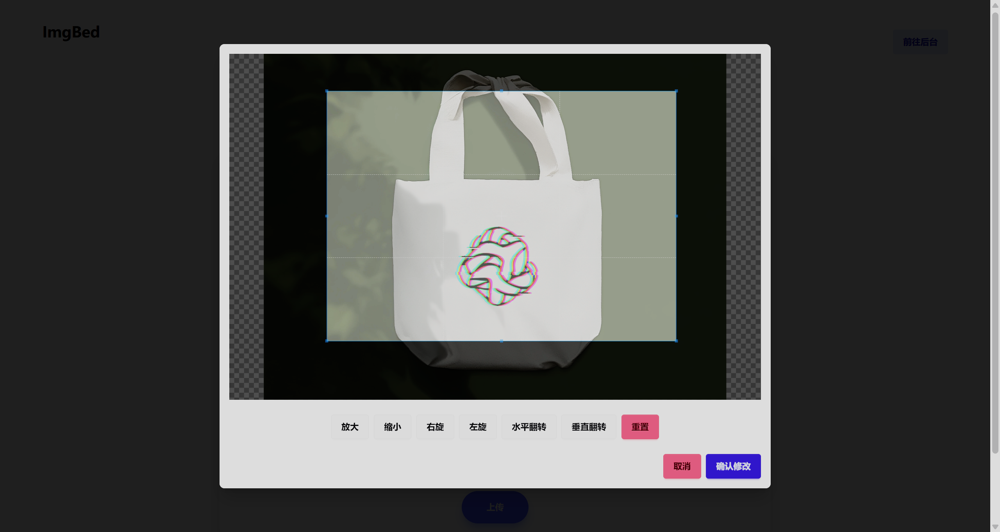
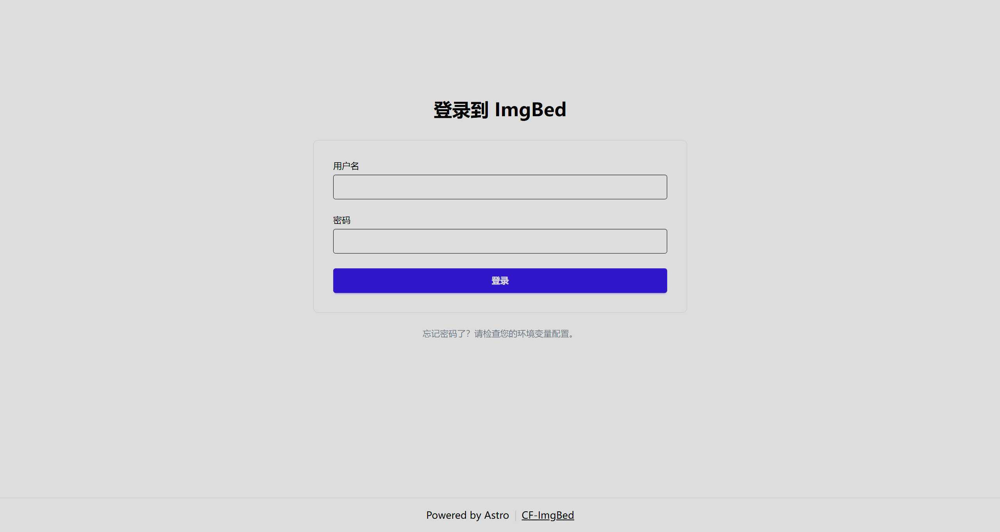
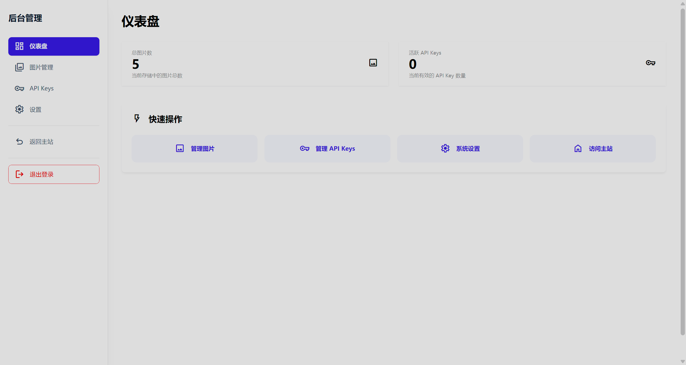
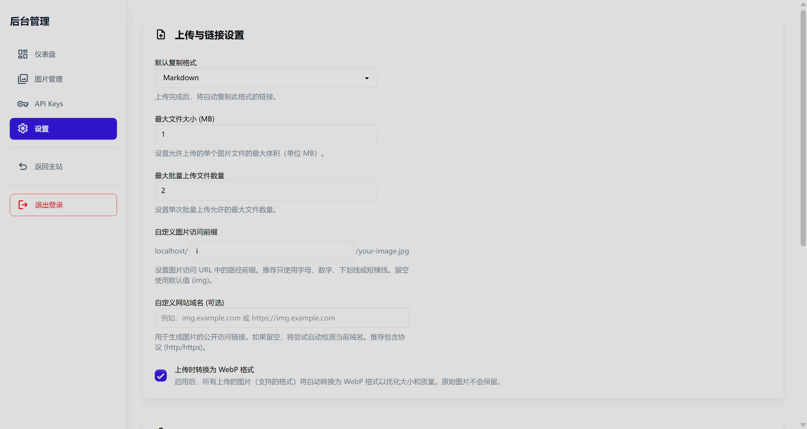

# CF-ImgBed: Cloudflare 图床应用

一个基于 Astro 和 Cloudflare 构建的现代化、简约风格的个人图床网站。使用 Cloudflare R2 进行图片存储，Cloudflare KV 存储元数据，并通过 Cloudflare Pages/Workers 提供服务。

## ✨ 功能特性

- **图片上传**:
    - 支持拖拽上传、点击选择文件、粘贴图片上传。
    - 支持批量上传。
    - 可指定上传目录。
    - 支持上传前图片编辑
    - 上传后显示多种格式的访问链接 (URL, Markdown, HTML)，支持点击复制，并提供复制成功反馈。
- **认证与授权**:
    - 用户登录认证后方可上传和管理。
    - 支持 API Key 认证上传。
- **后台管理界面**:
    - **仪表盘**: 显示图片总数、活跃 API Key 数量、快捷访问。
    - **图片管理**:
        - 目录式浏览，支持面包屑导航。
        - 显示当前目录下图片的总大小。
        - 支持图片的列出、预览、删除、批量删除、移动到其他目录。
    - **API Key 管理**: 生成、列出、撤销 API Key。
    - **设置**: 配置默认复制格式、图片访问前缀、自定义网站域名、上传限制、防盗链及白名单域名等。
- **图片访问**:
    - 支持自定义图片访问URL前缀。
    - 每张图片拥有基于短 ID 的访问链接。
    - 支持基本防盗链功能。

## 🛠️ 技术栈

- **框架**: [Astro](https://astro.build/)
- **运行环境**: [Cloudflare Pages](https://pages.cloudflare.com/) / [Cloudflare Workers](https://workers.cloudflare.com/)
- **图片存储**: [Cloudflare R2](https://developers.cloudflare.com/r2/)
- **元数据存储**: [Cloudflare KV](https://developers.cloudflare.com/kv/)
- **样式**: [Tailwind CSS v4](https://tailwindcss.com/)
- **依赖管理**: [pnpm](https://pnpm.io/)

## 预览











## 🚀 部署与配置

### 1. 克隆项目

```bash
git clone https://github.com/twiify/CF-ImgBed
cd CF-ImgBed
```

### 2. 安装依赖

```bash
pnpm install
```

### 3. Cloudflare 配置

您需要在 Cloudflare Dashboard 中创建以下资源：

- **R2 存储桶**: 用于存储图片文件。
    - 记下存储桶的名称 (Bucket Name)。
- **KV 命名空间**: 用于存储图片元数据、API Key、设置等。
    - 记下命名空间的 ID。

### 4. Wrangler 配置文件 (`wrangler.jsonc`)

编辑项目根目录下的 `wrangler.jsonc` 文件，填入您在上一步中创建的资源信息：

```jsonc
{
    // ... 其他配置 ...
    "vars": {
        "AUTH_USERNAME": "your_admin_username", // 替换为您的后台登录用户名
        "AUTH_PASSWORD": "your_admin_password", // 替换为您的后台登录密码 (生产环境强烈建议使用 Secrets)
    },
    "kv_namespaces": [
        {
            "binding": "IMGBED_KV", // 代码中使用的绑定名称 (请勿修改)
            "id": "your_kv_namespace_id", // 替换为您的 KV Namespace ID
            // "preview_id": "your_kv_namespace_preview_id" // 可选，用于本地预览的 KV ID
        },
    ],
    "r2_buckets": [
        {
            "binding": "IMGBED_R2", // 代码中使用的绑定名称 (请勿修改)
            "bucket_name": "your_r2_bucket_name", // 替换为您的 R2 存储桶名称
            // "preview_bucket_name": "your_r2_preview_bucket_name" // 可选
        },
    ],
}
```

**重要**: 对于生产环境，`AUTH_USERNAME` 和 `AUTH_PASSWORD` 应通过 Cloudflare Dashboard 中的 Secrets 进行配置，而不是直接写入 `wrangler.jsonc` 的 `vars` 中。

- 在 Cloudflare Pages 项目设置中 -> Environment Variables -> Add secret。
- 添加 `AUTH_USERNAME` 和 `AUTH_PASSWORD`。

### 5. 本地开发 (可选)

```bash
pnpm run dev
```

这将启动 Astro 开发服务器，通常结合 Miniflare 进行本地 Cloudflare 环境模拟。您可能需要：

- 创建一个 `.dev.vars` 文件在项目根目录，并填入：
    ```
    AUTH_USERNAME="your_local_username"
    AUTH_PASSWORD="your_local_password"
    ```
- 对于 KV 和 R2 的本地模拟，Wrangler 会尝试在 `.wrangler/state/v3/` 目录下创建本地存储。确保 Wrangler (`wrangler login`) 已正确配置并登录。

### 6. 部署到 Cloudflare Pages

- 将您的代码推送到 GitHub/GitLab 仓库。
- 在 Cloudflare Dashboard 中，进入 Pages -> Create a project -> Connect to Git。
- 选择您的仓库和分支。
- **构建设置**:
    - **Framework preset**: Astro
    - **Build command**: `pnpm build` (对应 `package.json` 中的 `astro build`)
    - **Build output directory**: `dist` (Astro 默认输出目录)
- **环境变量与绑定**:
    - 在 Pages 项目的 Settings -> Environment Variables 中，确保已配置生产用的 `AUTH_USERNAME` 和 `AUTH_PASSWORD` (作为 Secrets)。
    - 在 Settings -> Functions -> KV namespace bindings 中，添加绑定：
        - Variable name: `IMGBED_KV`
        - KV namespace: 选择您创建的 KV 命名空间。
    - 在 Settings -> Functions -> R2 bucket bindings 中，添加绑定：
        - Variable name: `IMGBED_R2`
        - R2 bucket: 选择您创建的 R2 存储桶。
- 点击 "Save and Deploy"。

### 7. 配置网站设置

部署完成后，访问您的网站后台 (`/admin/settings`) 进行以下配置：

- **自定义网站域名**: (例如 `https://img.yourdomain.com`) 用于生成图片的公开链接。如果留空，系统会尝试使用当前请求的域名。
- **自定义图片访问前缀**: (例如 `i`, `files`) 图片链接会是 `yourdomain.com/<prefix>/imageId.ext`。默认为 `img`。
- **防盗链设置**: 启用并配置允许的域名。

## 🔌 API 上传

图片可以通过 API Key 进行上传。

### 1. 生成 API Key

- 登录后台管理界面。
- 导航到 "API Keys" 页面。
- 点击 "生成新的 API Key"，输入一个名称（可选），然后生成。
- **立即复制并妥善保管生成的完整 API Key**。关闭弹窗后将无法再次查看。

### 2. 上传请求

向 `/api/upload` 端点发送 `POST` 请求。

- **Method**: `POST`
- **Headers**:

    - `X-API-Key: your_full_api_key` (推荐)
    - 或 `Authorization: Bearer your_full_api_key`
    - `Content-Type`: 根据上传方式变化，见下文。

- **上传方式及 Body/Query Params**:

    1.  **`multipart/form-data` (推荐用于文件上传)**:

        - `Content-Type: multipart/form-data; boundary=----WebKitFormBoundary...`
        - **Body** (form-data):
            - `files`: 图片文件。可以发送多个同名字段 `files` 以实现批量上传。
            - `uploadDirectory` (可选): 字符串，指定上传目录，例如 `wallpapers/nature`。

    2.  **`application/json` (例如 PicGo 等客户端)**:

        - `Content-Type: application/json`
        - **Body** (raw JSON):
            ```json
            {
                "list": [
                    "data:image/png;base64,iVBORw0KGgoAAAANSUhEUgAAAAUA..." // Base64 编码的图片数据
                ],
                "uploadDirectory": "optional/path" // 可选，也接受 "directory" 字段
            }
            ```
            - `list`: 包含一个或多个Base64编码的Data URL格式的图片字符串的数组。
            - `uploadDirectory` / `directory` (可选): 字符串，指定上传目录。

    3.  **二进制流 (Raw binary data)**:
        - `Content-Type`: 图片的MIME类型，例如 `image/png`, `image/jpeg`。
        - **Body**: 直接发送文件的二进制内容。
        - **URL Query Parameters**:
            - `filename` (可选): 指定文件名，例如 `myphoto.jpg`。如果未提供，会根据Content-Type生成一个通用文件名。
            - `directory` (可选): 指定上传目录。

#### 示例 (cURL for `multipart/form-data`)

```bash
curl -X POST \
  -H "X-API-Key: imgbed_sk_xxxxxxxxxxxx_yyyyyyyyyyyyyyyyyyyyyyyyyyyyyyyy" \
  -F "files=@/path/to/your/image1.jpg" \
  -F "files=@/path/to/your/image2.png" \
  -F "uploadDirectory=my_uploads/summer" \
  https://your-imgbed-domain.com/api/upload
```

#### 响应示例 (JSON)

当所有文件都成功上传时，响应状态码为 `200`:

```json
{
    "success": true,
    "message": "成功上传 2 个文件",
    "data": [
        // 数组，包含所有成功上传的文件信息
        {
            "id": "shortId1",
            "r2Key": "my_uploads/summer/shortId1.jpg",
            "fileName": "image1.jpg",
            "contentType": "image/jpeg",
            "size": 102400, // bytes
            "uploadedAt": "2023-10-27T10:00:00.000Z",
            "userId": "user_id_associated_with_api_key",
            "uploadPath": "my_uploads/summer",
            "url": "https://your-imgbed-domain.com/img/shortId1.jpg" // 公开访问 URL
        },
        {
            "id": "shortId2",
            "r2Key": "my_uploads/summer/shortId2.png",
            "fileName": "image2.png",
            "contentType": "image/png",
            "size": 51200,
            "uploadedAt": "2023-10-27T10:00:05.000Z",
            "userId": "user_id_associated_with_api_key",
            "uploadPath": "my_uploads/summer",
            "url": "https://your-imgbed-domain.com/img/shortId2.png"
        }
    ],
    "results": [
        // 数组，包含每个文件的处理结果
        {
            "success": true,
            "fileName": "image1.jpg",
            "data": {
                /* 同上 data 数组中的对象结构 */
            }
        },
        {
            "success": true,
            "fileName": "image2.png",
            "data": {
                /* 同上 data 数组中的对象结构 */
            }
        }
    ]
}
```

当部分文件上传成功，部分失败时，响应状态码仍为 `200`，但 `success` 字段为 `false`:

```json
{
    "success": false, // 因为并非所有文件都成功
    "message": "部分文件上传成功 (1/2)",
    "data": [
        // 只包含成功上传的文件信息
        {
            "id": "shortId1",
            "r2Key": "my_uploads/summer/shortId1.jpg",
            "fileName": "image1.jpg",
            "contentType": "image/jpeg",
            "size": 102400,
            "uploadedAt": "2023-10-27T10:00:00.000Z",
            "userId": "user_id_associated_with_api_key",
            "uploadPath": "my_uploads/summer",
            "url": "https://your-imgbed-domain.com/img/shortId1.jpg"
        }
    ],
    "results": [
        // 包含所有文件的处理结果
        {
            "success": true,
            "fileName": "image1.jpg",
            "data": {
                /* ... */
            }
        },
        {
            "success": false,
            "fileName": "image2.png",
            "message": "上传失败：文件过大或格式不支持" // 失败原因
        }
    ]
}
```

当所有文件都上传失败时，响应状态码为 `500` (或 `400`，取决于错误类型):

```json
{
    "success": false,
    "message": "所有文件上传失败",
    "results": [
        {
            "success": false,
            "fileName": "image1.jpg",
            "message": "错误: R2存储桶写入失败"
        },
        {
            "success": false,
            "fileName": "image2.png",
            "message": "错误: 元数据写入KV失败"
        }
    ]
    // "data" 字段可能不存在或为空数组
}
```

其他错误情况 (例如，无效的 API Key，请求格式错误等)，响应状态码可能是 `400`, `401`, `500` 等:

```json
{
    "success": false,
    "message": "未授权: 无效的 API Key" // 具体错误信息会变化
    // "results" 字段可能不存在
}
```

## 🤝 贡献

欢迎提交 Pull Requests 或 Issues。

## 📄 许可证

本项目采用 MIT 许可证。
